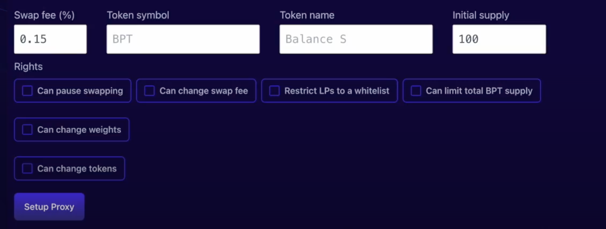
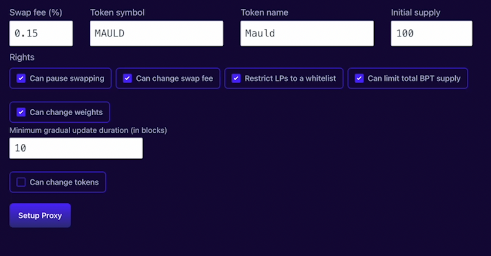
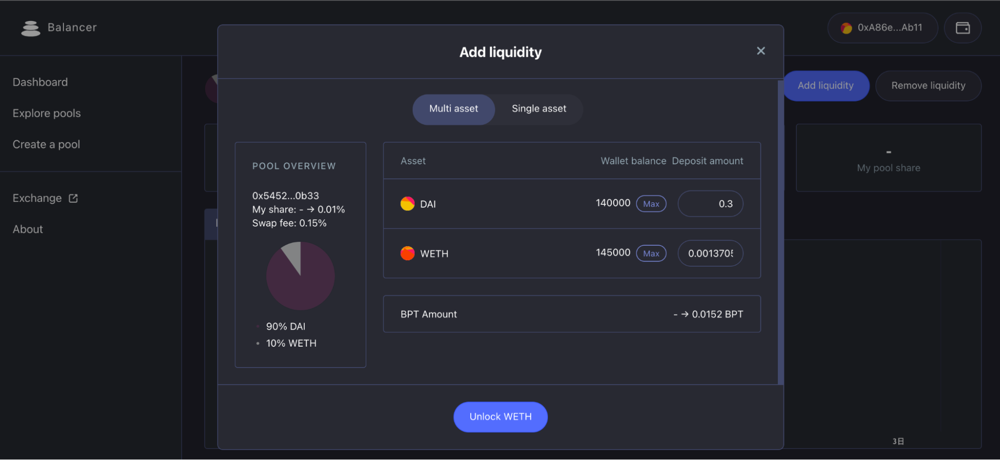
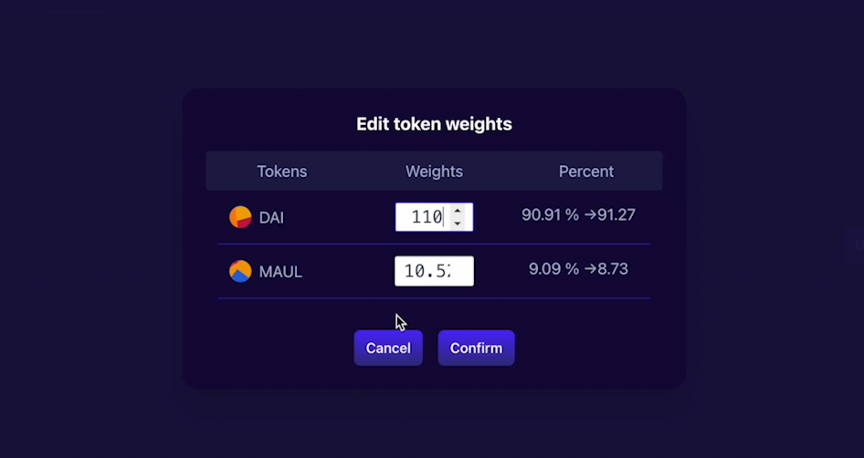

# Create pool

## Create a smart pool

Create a smart pool. You can set custom token symbols and names. You can also specify the initial supply of tokens, which is arbitrary.

 

Creating a pool requires setting relevant parameters according to the purpose of the pool.

 

* Swap can be paused - the controller can stop the transaction. This was originally a "panic button" but is more commonly used to delay the launch of a liquidity bootstrap pool, or to prevent carry trades while adjusting weights.

* Transaction fees can be changed - Controllers can change transaction fees after deployment, ranging from 0.0001% to 10%.

* The weight can be changed - the controller can change the weights arbitrarily (transferring tokens to keep the price constant) or set a schedule for the weight to change linearly over time - the heart of the liquidity bootstrap pool. Another important parameter is the minimum duration. The controller cannot initiate a progressive weight change faster than this duration.

* Tokens can be added/removed - controllers can add new tokens through a two-phase process involving a time lock. A minimum "lock-on-token" period is also specified at deployment time. This is a "dangerous" right because the controller can add a worthless token and drain it. (If the controller is malicious, the public LP can exit during the time lock period.) The controller can also remove existing tokens from the pool, which transfers the full balance of that token to the controller. Note that the controller must burn $BSN (pool token) to do this, so if public LPs are allowed, the controller may not have enough $BSN to actually do this.

* LPs must be whitelisted - anyone can add liquidity to the pool after creation unless their addresses are added to the whitelist.

* The cap can be changed - this limits the total supply of pool tokens. Initial supply is set in the deployment, so that no one can add liquidity unless the controller raises the cap. To increase liquidity, the controller can set the upper limit to "infinite".

The button will display "Unlock <Token Name>" for each token and prompt you to unlock each token, asking you to send a transaction to approve each token.

 

 

Once all tokens are approved, the button will display "Create" and pressing it will create the transaction.

 

Price warning popup

 

When you actually create a pool, the system will display the internal price visible to the exchange (based on weights and balances according to AMM logic) and ask you to confirm. This is very important! The system will allow you to create a pool with arbitrary prices, but if those prices deviate from current market rates, arbitrageurs will trade with the pool until the prices match, which potentially drains most of its value.

 
 

If the token you want to add is not listed on the token selector panel, you can add any custom token by pasting its address in the search field.

 

IMPORTANT: Make sure the custom token you are adding is ERC20 compliant.

## Add liquidity
Click on "explore pools" and find the smart pool you just created under the "smart" button.

Click "add liquidity" to add appropriate liquidity to the smart pool.

 

## Set gradual weight
Set the drop ratio and determine the start and end blocks.

 

When the start block is reached, click "actions" so that the smart pool will continue to gradually update the weight according to the settings.

 

