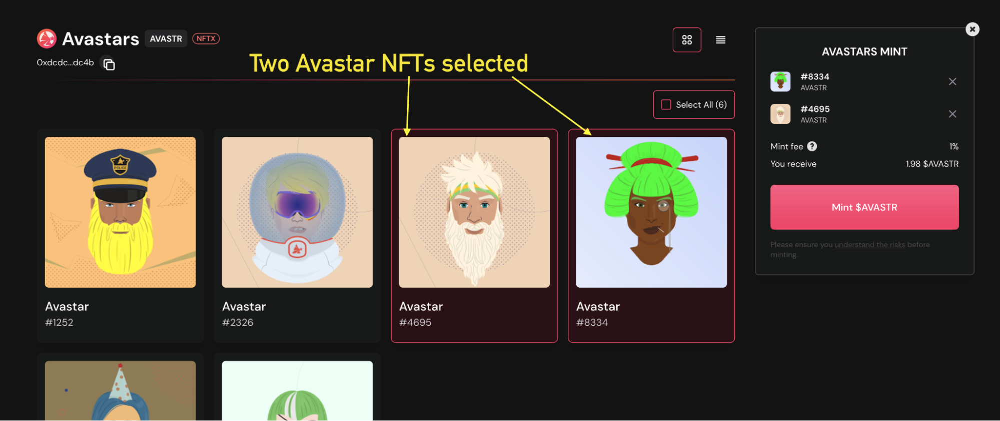

# Minting

选择一个金库，选择钱包中同系列NFT（可以单个也可以多个NFT一起）进行mint到保险库，转化为vToken。
tips：金库通常是地板金库，铸造更高价值的 NFT 将提供与收藏中价值较低的 NFT 相同的结果。

单击“mint”按钮生成 vToken。每个 NFT 将返回一个 vToken，减去铸币费（5%）。

目前限制铸币者扫描钱包的前 1,000 个可用于铸币的 NFT。