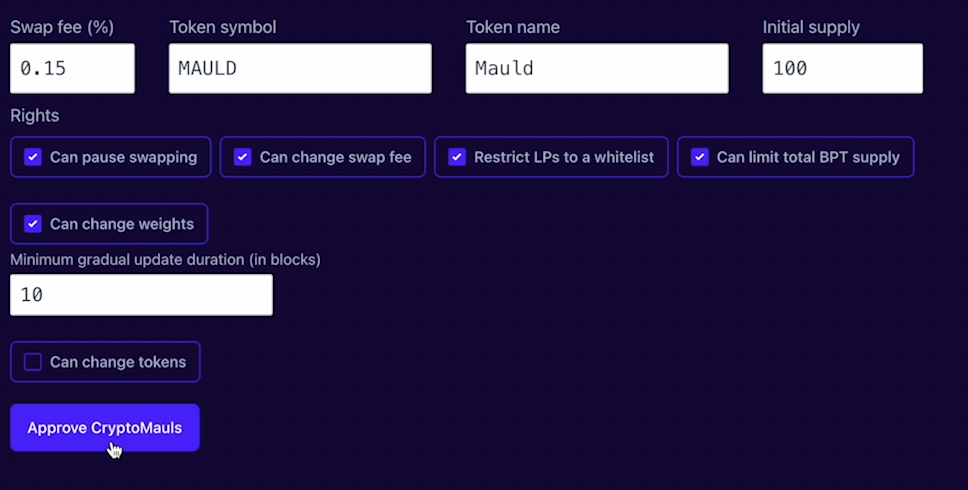
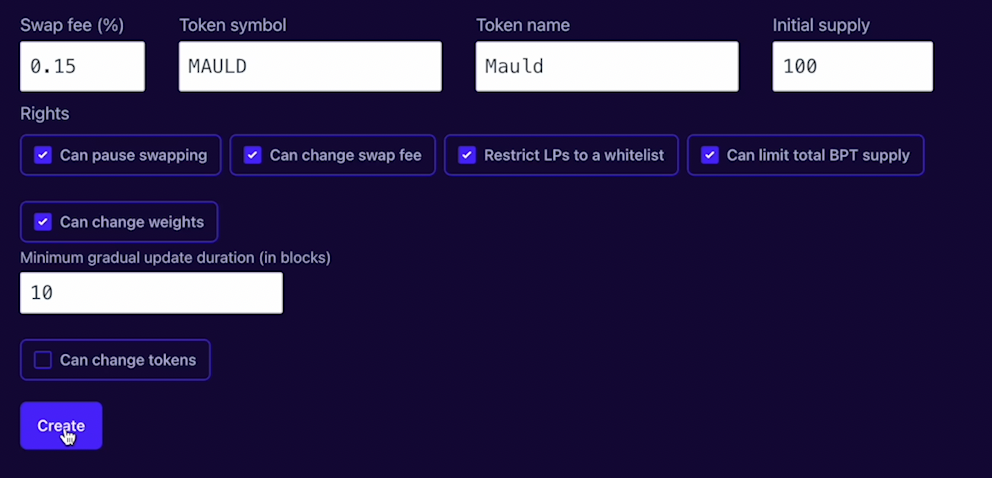
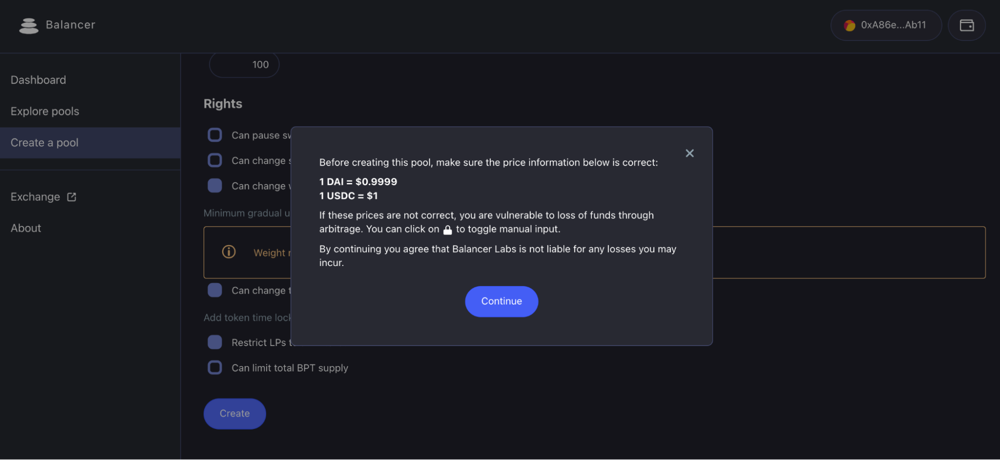
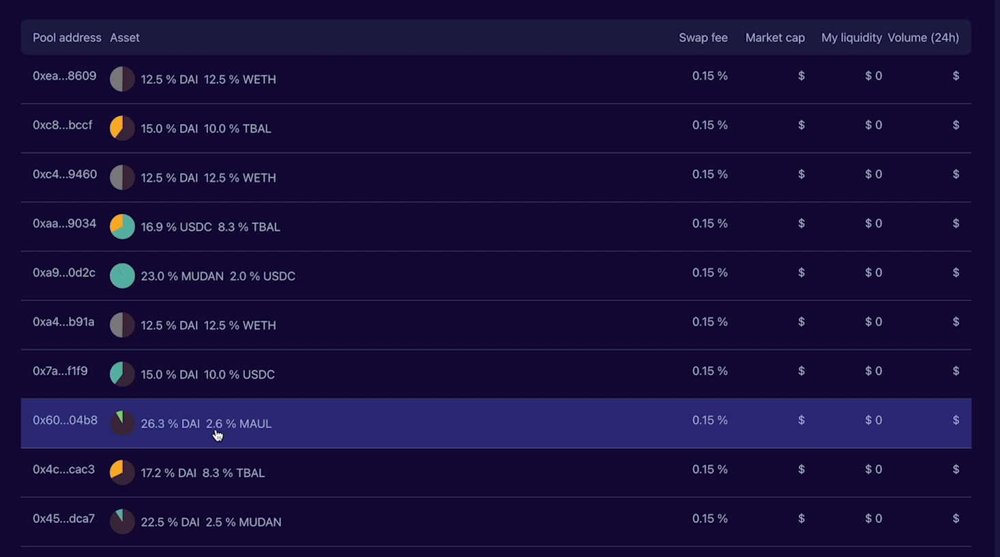

# Create pool
## 创建智能池

创建一个智能池。您可以设置自定义令牌符号和名称。您还可以指定令牌的初始供应，这是任意的。

创建智能池需要根据池的目的设置相关参数。

* 可以暂停swap-控制器可以停止交易。这最初是一个“恐慌按钮”，但更常用于推迟流动性引导池的启动，或在调整权重时防止套利交易。]

* 可以更改交易费-控制器可以在部署后更改交易费，范围在0.0001%至10%。

* 可以更改权重-控制器可以任意更改权重（转移代币以保持价格不变），也可以为权重随着时间的推移线性变化设定时间表——流动性引导池的核心。另一个重要参数是最小持续时间。控制器无法启动比该持续时间更快的渐进式权重变化。

* 可以添加/删除令牌-控制器可以通过涉及time lock的两阶段流程添加新令牌。部署时还指定了最小的“添加令牌时锁”周期。这是一个“危险”的权利，因为控制器可以添加一个毫无价值的代币并排干。（如果控制器是恶意的，公共LP有时锁期可以退出。）

控制器还可以从池中删除现有令牌，该池将该令牌的全部余额传输给控制器。请注意，控制器必须刻录$BSN（池令牌）才能执行此操作，因此，如果允许公共LP，控制器可能没有足够的$BSN来实际执行此操作

* 必须将LP列入白名单-除非他们的地址被添加到白名单中，否则任何人可以在创建后向池中添加流动性。

* 可以更改上限-这限制了池代币的总供应量。部署时设置为初始供应，因此除非控制器提高上限，否则任何人都无法增加流动性。若想增加流动性，控制器可以将上限设置为“无限”。

按钮将为每个令牌显示“解锁<令牌名称>”。并提示您解锁每个令牌，要求您发送交易来批准每个令牌。

一旦所有令牌获得批准，该按钮将显示“创建”，然后按下它将创建交易。

价格警告弹出窗口

当您实际创建池时，系统将显示交易所可见的内部价格（根据AMM逻辑，基于权重和平衡），并要求您确认。这非常重要！该系统将允许您创建一个具有任意价格的池，但如果这些价格偏离当前市场利率，套利者将与池进行交易，直到价格匹配，这可能会耗尽其大部分价值。

如果您要添加的令牌没有列在令牌选择器面板上，您可以通过在搜索字段中粘贴其地址来添加任何自定义令牌。

重要信息：确保您要添加的自定义令牌符合ERC20标准。

## 添加流动性

点击「explore pools」，在「smart」按钮下，您将找到刚建立的智能池。

点击「add liquid」，为智能池添加适当的流动性。

## 设置动态权重

设置下降比例，确定开始及结束区块。

当达到开始区块后，点击「actions」，智能池将会按照设定，进行持续渐进性的权重更新。

