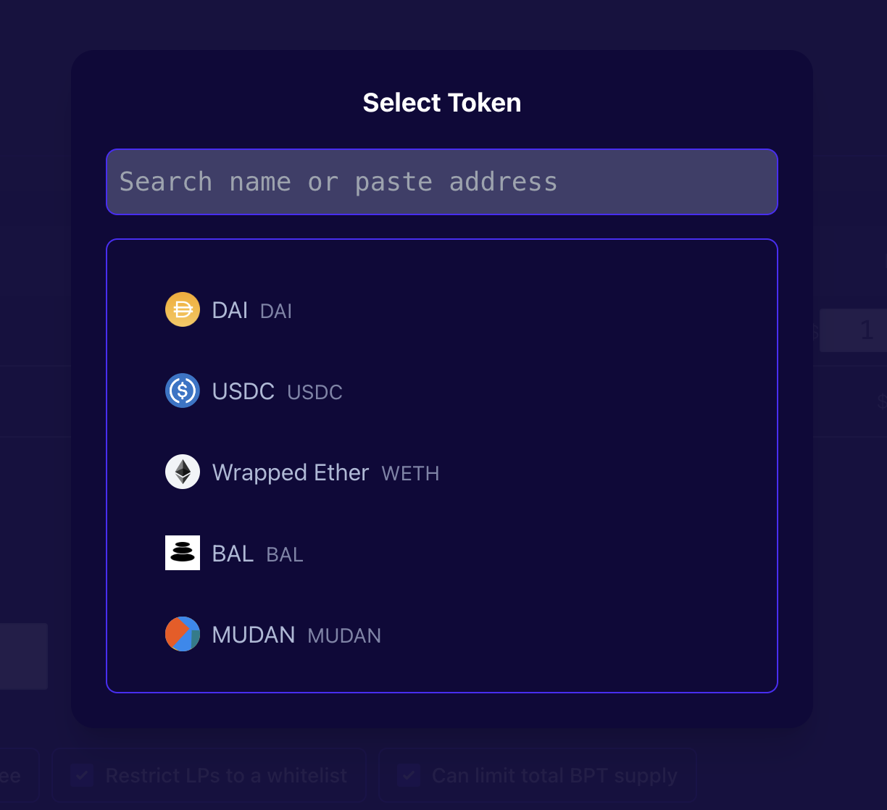
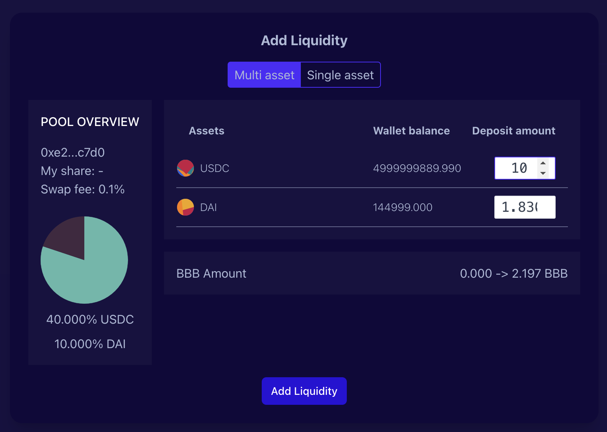

# Create pool
## 创建启动池

创建一个启动池。您可以设置自定义令牌符号和名称。您还可以指定令牌的初始供应，这是任意的。

创建启动池需要根据池的目的设置相关参数。

* 可以暂停swap-控制器可以停止交易。

* 可以更改交易费-控制器可以在部署后更改交易费，范围在0.0001%至10%。

* 可以更改权重-控制器可以任意更改权重（转移代币以保持价格不变）。

* 可以添加/删除令牌-控制器。

* 将LP列入白名单-除非他们的地址被添加到白名单中，否则任何人可以在创建后向池中添加流动性。

* 可以更改上限-这限制了池代币的总供应量。

一旦所有令牌获得批准，该按钮将显示“创建”，然后按下它将创建交易。

Tips：如果您要添加的令牌没有列在令牌选择器面板上，您可以通过在搜索字段中粘贴其地址来添加任何自定义令牌。

重要信息：确保您要添加的自定义令牌符合ERC20标准。

## 添加流动性

点击「explore pools」，您将找到刚建立的启动池。

点击「add liquid」，为智能池添加适当的流动性。

## 设置动态权重

设置下降比例，点击确认，系统将自动更新您的下降幅度。

