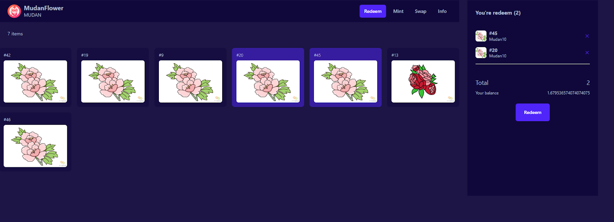

# Redeeming
## 定向赎回
通过支付定向赎回费用（通常为 5% ， 1.05 个 vToken）来从金库中定向赎回特定的 NFT。没有vToken也可去流动性资金池兑换，进行赎回。

在金库中选择想要赎回的nft或数量（整数）并批准合约。一旦批准交易得到确认，就可以从金库中赎回所需数量的 NFT。

## 随机赎回
无需费用，输入您想要赎回的数量（整数）并批准合约。一旦批准交易得到确认，您就可以从金库中赎回所需数量的 NFT。

