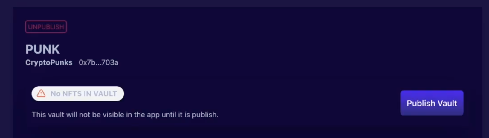

# Vault Creation

## 创建金库
### 填写相关金库信息：

* 填写NFT资产地址

NFT 资产地址是不可变的,默认情况下，该合约中的所有 NFT ID 都可以在金库中铸造。

* 金库名称

这将所创建金库的名称。

* 此金库铸造的ERC-20代币符号

这将是从这个金库铸造的vToken的符号。

### 金库已创建
一旦创建金库交易在链上得到确认，将收到通知并要求继续管理您的金库。
在铸造并发布之前，您的金库将不会在BootstrapNFT应用程序中可见。

## 管理金库
金库管理允许金库创建者修改许多重要设置以及发布金库。
tips：创建者无法编辑已发布的金库，只有 DAO 可以对已发布的金库进行更新。

### 启用 Vault 功能

**启用铸造**——创建金库最重要的部分是允许用户铸造他们的 NFT。如果您想使用金库作为空投代币的方式，让用户从金库中兑换 NFT，您可以禁用铸造功能。

**启用随机赎回**——允许用户从您的金库中随机赎回NFT。

**启用目标赎回**——用户将能够选择他们从保险库中赎回的 NFT，您可以在“费用”部分中设置额外费用。

**启用随机交换**——允许用户从您的金库中随机交换NFT。

**启用目标交换**——允许用户从您的金库中特定交换NFT。

### 费用

可以在各个金库上设置费用。默认情况下，所有新金库都设置为 5% 的铸币费（意味着您每铸造一个 NFT 会收到 0.95 个代币）、0% 的赎回费（因此 1 个代币始终可以从金库中赎回 1 个随机 NFT）和 5% 的目标赎回费（需要 1.05 个代币才能从保险库中选择您想要的 NFT）。

## 发布金库

在应用程序上显示金库之前，需要至少铸造一个符合条件的 NFT。

将一个或多个 NFT 添加到新保管库后，您将可以选择发布保管库。
