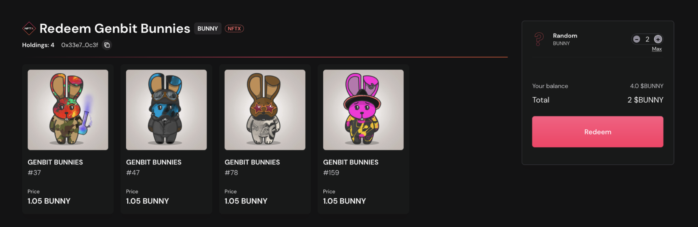

# Redeeming

## Targeted redemption

Specific NFTs are targeted-redeemed from the vault by paying a targeted redemption fee (usually 5%, 1.05 vTokens). You can go to the liquidity pool to exchange and redeem without vToken.

 

Select the nft or amount (integer) you want to redeem in the vault and approve the contract. Once the approved transaction is confirmed, the required amount of NFT can be redeemed from the vault.

 

## Random redemption

No fee. Enter the amount you want to redeem (integer) and approve the contract. Once the approved transaction is confirmed, you can redeem the desired amount of NFT from the vault.