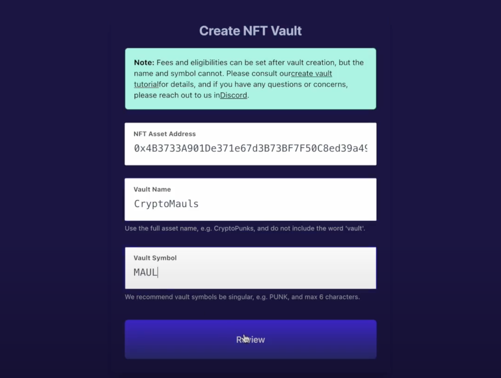
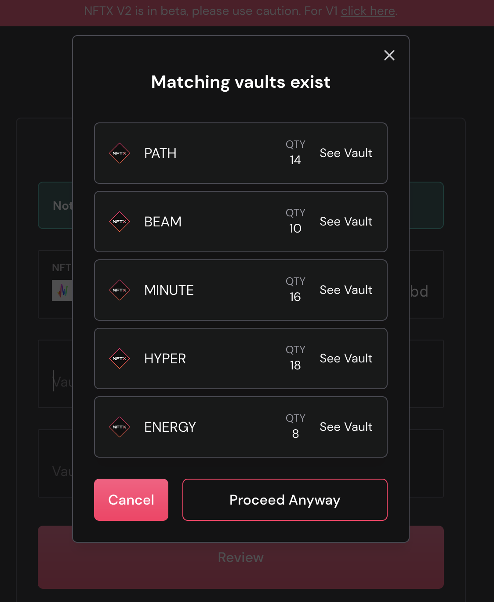
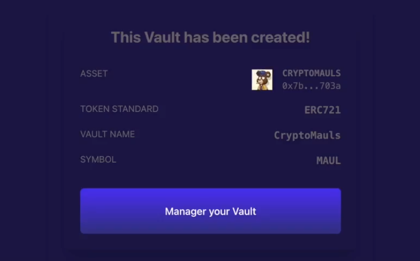
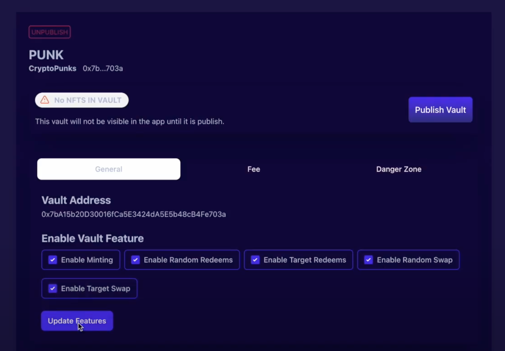
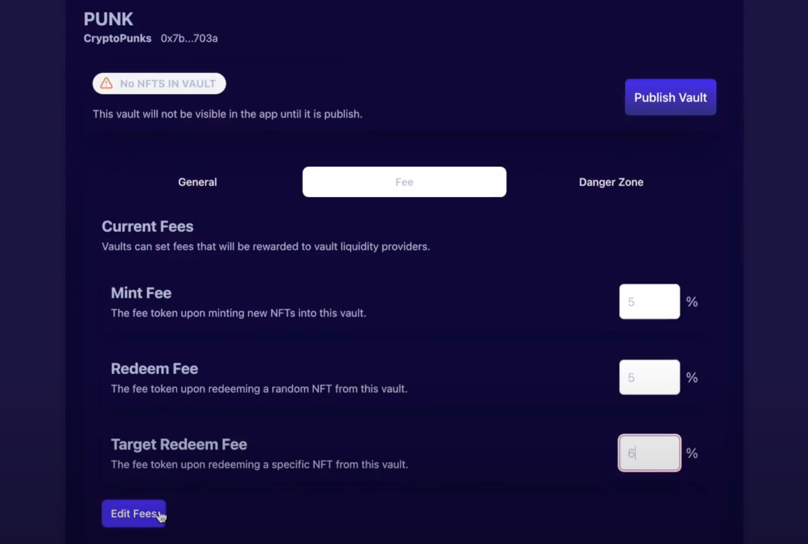
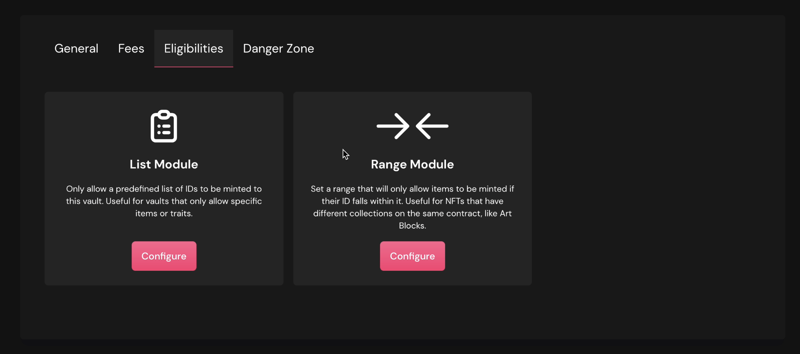
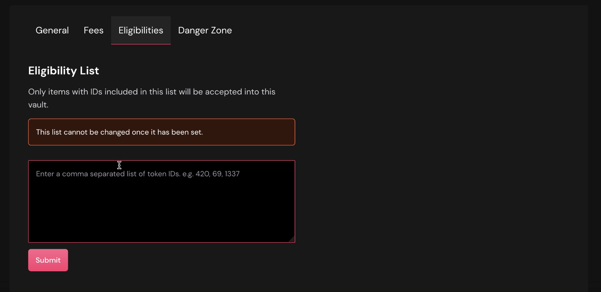
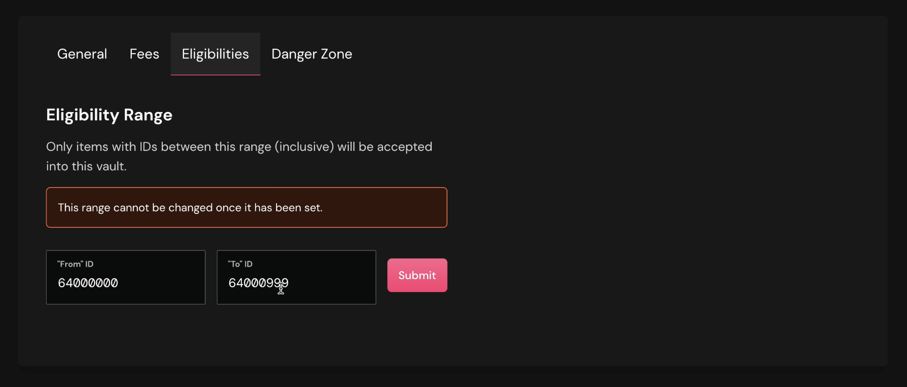
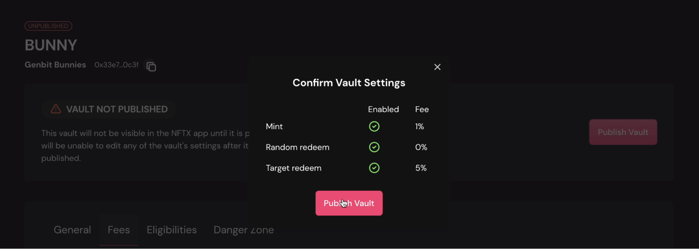
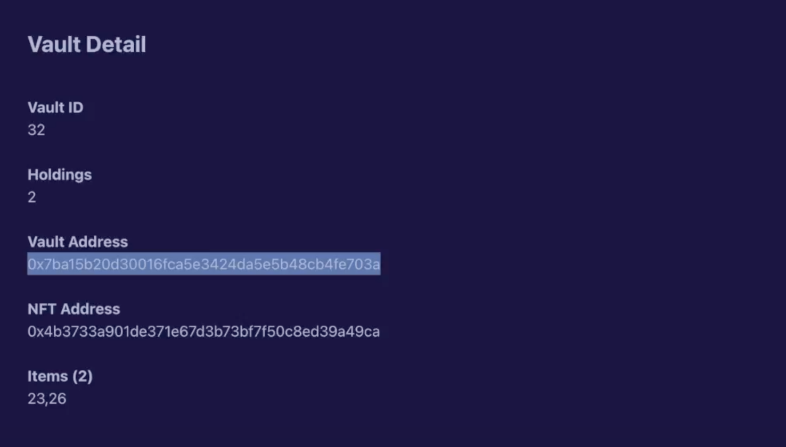

# Vault Creation
## Create a vault

1. Fill in the relevant vault information:

* Fill in the NFT asset address
NFT asset address is immutable, and all NFT IDs in this contract can be minted in the vault by default.

Tips: Some assets are already used in other vaults. Please check the matching vaults list before proceeding to avoid adding vaults repeatly and splitting liquidity.

* Vault name

This will be the name of the created vault.

 

* ERC-20 token symbol minted by this vault

This will be the symbol of the vToken minted from this vault.

## The vault has been created

Once the vault creation transaction is confirmed on-chain, you will be notified and asked to continue managing your vault.

Your vault will not be visible in the BootstrapNFT app until any vToken is minted and published.

# Manage the treasury
Vault management allows vault creators to modify many important settings as well as publishing vaults.

Tips: Creators cannot edit published vaults. Only DAO can update published vaults.

Enable Vault features

**Enable Minting** - The most important part of creating a vault is allowing users to mint their NFTs. You can disable minting if you want to use the vault as a way to airdrop tokens and let users redeem NFTs from the vault.

**Enable Random Redemption** - Allows users to randomly redeem NFTs from your vault.

**Enable Target Redemption** - Users will be able to choose which NFT they redeem from the vault. Additional fees can be set in the Fees section.

Fees

Fees can be set on individual vault. By default, all new vaults are set to 5% minting fee (meaning you receive 0.95 tokens for every NFT minted), 0% redemption fee (so 1 token is always redeemable from the vault 1 random NFT back) and a target redemption fee of 5% (1.05 tokens required to select the NFT you want from the vault).

Eligibilities

A vault's eligibility list is the allowed list or range of NFT IDs that can be minted to this vault.

 

Eligibility List

This setting is used for a specific personal ID to add to the list of qualifications.

 

Eligibility Range

For eligible ID blocks, this setting is used to specify the From and To (inclusive) IDs that will be added to the eligibility list.

## Publish Vault
At least one eligible NFT needs to be minted before the vault can be published on the app.

 

After adding one or more NFTs to the new vault, you will have the option to publish the vault.

Confirm the setting information again after the confirmation. On this page, it will give you an overview of the vault details, including the vault ID, vault URL, vault token address, current holdings, and lifetime fees.

## Verify the vault

After the vault is created and published, the vault icon also needs to be provided in order to pass the final verification process.

1.Vault Name: The name of the vault (not the token name).

2.Vault ID: You can find the Vault ID on the Info tab on the Vault page in the right sidebar (at the bottom if you're on a mobile device).

3.Discord username (i.e. javery#3313)

4.Vault icon: Upload a 512x512px transparent PNG icon that you wish to associate with the vault. See the CryptoPunk icon example below.

5.Signed message: visit https://app.mycrypto.com/sign-message and use the wallet you used to create the vault to create a signed message. This allows the BootstrapNFT DAO to confirm that the request comes from the owner of the vault. When adding a signed message, make sure you signed the message with the wallet you used to create the vault.

 